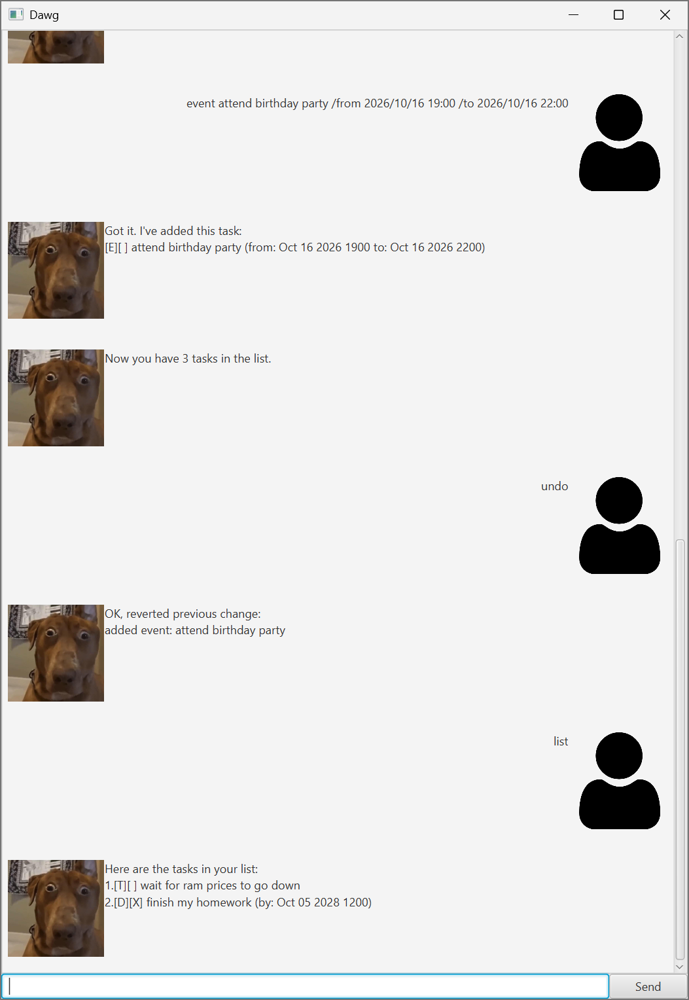

# Dawg User Guide



Dawg is a chatbot desgined to manage your todo lists efficiently.

# Formatting
Unless otherwise stated, the following terms used in the document will refer to the following:
- Words in UPPER_CASE are user supplied arguments
- Any `Date`s required are in the format `yyyy/MM/dd HH:mm`
    - Example: `2026/10/16 22:30`

# Features

## Adding Tasks

### Adding a Todo
Add a todo task, a generic type of task that does not require any specific details

Format: `todo DESCRIPTION`

Example: `todo wait for ram prices to go down`

Output: a preview of the todo task that was added

### Adding a Deadline
Add a deadline task, a type of task that requires you to do something by a certain `Date`

Format: `deadline DESCRIPTION /by DO_BY_DATE`

Example: `deadline finish my homework /by 2028/10/05 12:00`

Output: a preview of the deadline task that was added

### Adding an Event
Add a event task, a type of task that occurs between a `Date` range

Format: `event DESCRIPTION /from START_DATE /to END_DATE`

Example: `event attend birthday party /from 2026/10/16 19:00 /to 2026/10/16 22:00`

Output: a preview of the event task that was added

## Mark/Unmark task
Mark/unmark task completion status. Task number as specified in output of `list` command.\
See [list](#list-tasks) for more information

Format: `mark TASK_NUMBER`\
Format: `unmark TASK_NUMBER`

Example: `mark 2`

Output: which task was marked/unmarked

## Delete task
Deletes a task. Task number as specified in output of `list` command.\
See [list](#list-tasks) for more information

Format: `delete TASK_NUMBER`

Example: `delete 3`

## List tasks
Lists all tasks in a nicely formatted view

Format: `list`

Output: a task per line. In order of appearance,
- task type (e.g. todo, event, etc.)
- completion status
- description
- additional associated info (dates, etc.)

Output sample:
```
Here are the tasks in your list:
1.[T][] wait for ram prices to go down
2.[D][X] finish my homework (by: Oct 05 2028 1200)
```

## Find tasks
Search for a task by description. 

Format: `find QUERY`

Example: `find homework`

Output: list of tasks that match the query provided

## History management
Any modifications to the todo list are captured and can be reverted if necessary

### Show history
List past actions that can be reverted with `undo` command.

Format: `history`

Output: list of past actions that can be undone in chronological order, most recent action at the bottom.

### Undo
Undoes the most recent action

Format: `undo`

Output: what action was undone

## Bye
Exits the application

Format: `bye`